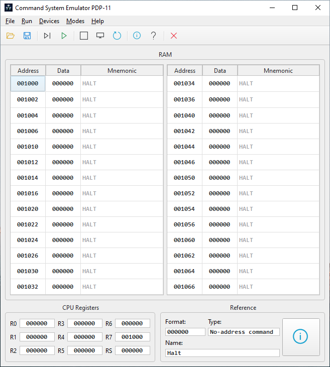
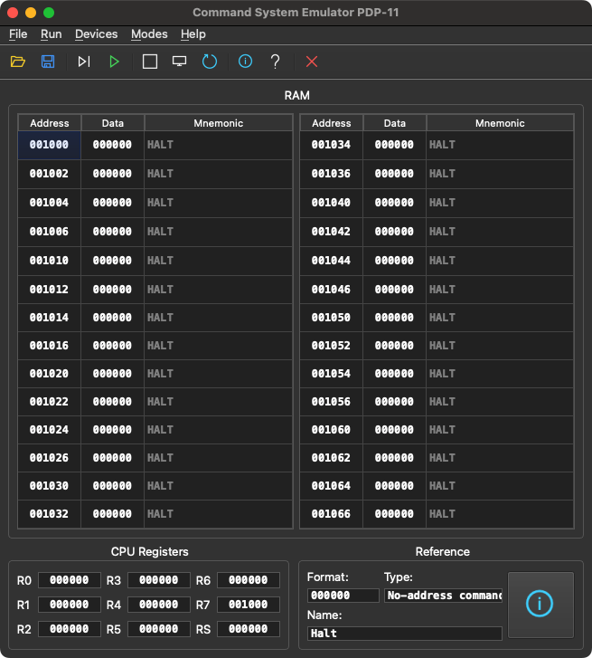

*[🇷🇺 Читать на русском / Read in Russian](README_RU.md)*

# 🖥️ Command System Emulator PDP-11

| 🐧 Linux (Dark) | 🪟 Windows (Light) | 🍎 macOS (Dark) |
| :---: | :---: | :---: |
|  |  |  |


**Command System Emulator PDP-11** is a cross-platform emulator of the classic PDP-11 architecture with a graphical user interface. The project was created for educational purposes to study computer architecture, assembly language, and the principles of processor operation.

The emulator is written in **C++17** using the **Qt6** framework. It supports on-the-fly machine code disassembly, step-by-step debugging, and operation with virtual external devices (display, keyboard, printer, graphics display).

---

## ✨ Key Features

*   **Interactive memory and registers:** View and edit the contents of RAM and processor registers (R0-R7, PSW) in real time.
*   **Built-in disassembler:** Automatic translation of entered octal machine codes into PDP-11 assembly mnemonics directly in the memory table.
*   **Execution modes:** 
    *   `Step Mode` — step-by-step execution for detailed debugging.
    *   `Program Mode` — continuous execution.
*   **Virtual external devices (Memory-Mapped I/O):**
    *   Keyboard (TKS `177560`, TKB `177562`)
    *   Terminal / Display (TPS `177564`, TPB `177566`)
    *   Printer (`177514`, `177516`)
    *   Graphical display (X coordinate `177570`, Y coordinate `177572`, Color / Draw trigger `177574`)
    *   Hardware timer with interrupt generation via vector `100(8)`.
*   **Graphical Mode:** Supports rendering a 64x64 pixel grid with a custom 16-color palette (CGA / EGA-style) via procedural assembly commands.
*   **Dynamic UI theme:** Automatic support for light and dark themes depending on your operating system settings (Linux / Windows / macOS).
*   **Help system:** Built-in context help for commands and an included detailed reference guide in [**PDF**](Docs/PDP11.pdf) and [**Markdown**](Docs/PDP11.md) formats.
*   **Bilingual support:** The application interface, built-in disassembler, context help for commands and detailed reference guide automatically adapt to your system's language (English / Russian).
*   **Save and load:** Support for importing and exporting programs in the `.pdp` format.

---

## 🚀 Example Programs

The `Programs/` folder contains ready-made programs for testing the emulator (details in the [**Program Descriptions.txt**](Docs/Program%20Descriptions.txt) file):

1.  **Hello World** — classic string output to the terminal screen using a loop and checking the device ready flag.
2.  **Keyboard** — echo input: reading characters from the keyboard and printing them to the screen, exiting by pressing the 'q' key.
3.  **Print** — text output to the virtual printing device.
4.  **Single-digit Adder** — basic arithmetic: accepts an expression like `3+4`, calculates the sum, and prints the result.
5.  **16-bit Adder and Subtractor** — multi-digit addition and subtraction. Features a binary-to-decimal ASCII conversion algorithm for outputting results to the terminal.
6.  **16-bit Integer Calculator** — a complete 4-function calculator (+, -, *, /). Implements software-level multiplication and division algorithms that are not part of the standard PDP-11 instruction set.
7.  **Stopwatch** — demonstrates the `WAIT` instruction and hardware timer. The program counts real-world seconds in register R0 by handling 10 timer interrupts (100ms each) per second, keeping the CPU in a low-power state between ticks.
8.  **Yellow Dot** — simplest test for the graphical subsystem. Sequentially writes coordinates and a color code to draw a single yellow pixel, then halts.
9.  **Rainbow Flag** — procedural graphics generation. Implements nested coordinate loops to draw a diagonal color gradient across the 64x64 screen.
10. **Bouncing Pixel** — real-time physical simulation. Computes boundary collision detection, reverses direction on impact, cycles colors on bounce, and uses duty cycle rendering optimization to prevent flickering.

---

## 🛠️ Build and Installation

### 🐧 Build on Linux (Arch Linux / Manjaro)

1. Install the necessary dependencies (compiler, CMake, Qt6):
   ```bash
   sudo pacman -S base-devel cmake qt6-base mesa
   ```
2. Clone the repository and run the build script:
   ```bash
   git clone https://github.com/Arta48/PDP11.git
   cd PDP11
   ```

**Option A: Run portable version**
You can quickly compile and run the emulator without system integration:
```bash
sh compile.sh
./build/PDP11
```

**Option B: System-wide Installation (Recommended)**
The project includes an automated packaging script that builds and installs the emulator as a native Arch Linux package. It generates a `.desktop` shortcut, scales icons, and places the executable in your system path.
```bash
sh setup_package.sh
```
*After installation, you can launch the emulator directly from your Desktop Environment's application menu or by simply typing `pdp11` in the terminal. To uninstall, run `sudo pacman -R pdp11`.*

### 🍎 Build and Installation on macOS (macOS 11.0+)

The simplest way is to download the pre-compiled universal **`PDP11.dmg`** directly from the [**Releases**](https://github.com/Arta48/PDP11/releases) page. It natively supports both Apple Silicon (M1 / M2 / M3) and Intel-based Macs.

To build the project from source manually:

1. Install the necessary dependencies via the Homebrew package manager (CMake, Qt6):
   ```bash
   brew install cmake qt6
   ```
2. Clone the repository:
   ```bash
   git clone https://github.com/Arta48/PDP11.git
   cd PDP11
   ```
3. Configure the build system, compile, and bundle all Qt dependencies into a portable `.dmg` installer:
   ```bash
   # Configure and build
   cmake -B build -DCMAKE_BUILD_TYPE=Release
   cmake --build build -j$(sysctl -n hw.ncpu)

   # Link dependencies into the app bundle and generate DMG
   macdeployqt build/PDP11.app -dmg
   ```
   *The generated `PDP11.dmg` file will be located inside the `build/` directory.*

### 🪟 Build on Windows

The project includes a script for a fully automated build of an independent `.exe` file that does not require pre-configuring the environment.

1. Run the `compile.bat` file (by double-clicking or via the console).
2. The script will do everything for you:
   * Download and install the **MSYS2** environment (into `C:\msys64`).
   * Download the GCC compiler, CMake, and a static version of Qt6 with all dependencies.
   * Configure and compile the project.
3. The compiled `PDP11.exe` file will be located in the `build-windows/` directory.

*💡 Note: To completely clean the system from the build environment after compilation is finished, you can simply delete the `C:\msys64` folder.*

### 🐧 Cross-compilation for Windows (from Linux)

The project supports building a static `.exe` file for Windows directly from Linux via MinGW cross-compilation.

1. Install MinGW and add the `ownstuff` repositories:
   ```bash
   sudo pacman -S mingw-w64-gcc
   
   if ! grep -q "ownstuff" /etc/pacman.conf; then
       echo -e "
   [ownstuff]
   SigLevel = Optional TrustAll
   Server = https://ftp.f3l.de/~martchus/\$repo/os/\$arch
   Server = https://martchus.dyn.f3l.de/repo/arch/\$repo/os/\$arch" | sudo tee -a /etc/pacman.conf > /dev/null
   fi
   
   sudo pacman-key --keyserver keyserver.ubuntu.com --recv-keys B9E36A7275FC61B464B67907E06FE8F53CDC6A4C
   sudo pacman-key --finger B9E36A7275FC61B464B67907E06FE8F53CDC6A4C
   sudo pacman-key --lsign-key B9E36A7275FC61B464B67907E06FE8F53CDC6A4C
   
   sudo pacman -Syy
   sudo pacman -S mingw-w64-cmake mingw-w64-qt6-base-static
   ```
2. Run the build script for Windows:
   ```bash
   sh compile_windows.sh
   ```
3. The compiled `PDP11.exe` file will be located in the `build-windows/` directory.

---

## 📁 Project Structure

*   `src/` — C++ source code (`Pdp11.cpp` - emulator core, `MainWindow.cpp` - graphical interface).
*   `assets/` — graphical interface resources (icons, fonts for UI).
*   `Docs/` — documentation: reference manual and detailed code logic descriptions.
*   `Programs/` — a collection of ready-made programs (`.pdp` dumps).
*   `CMakeLists.txt` — build system configuration.
