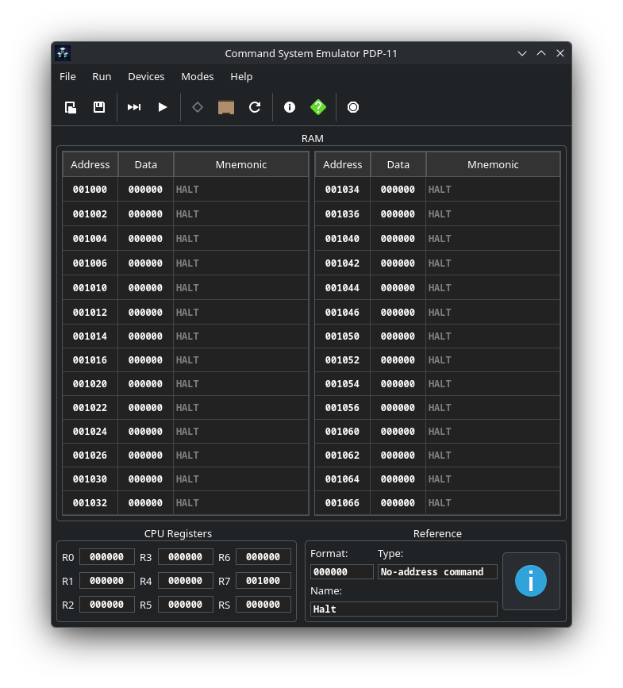
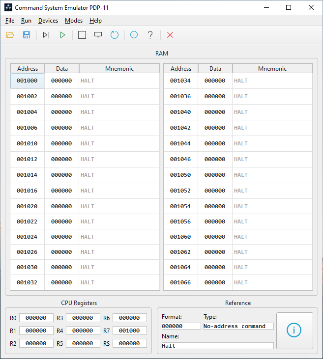

*[🇷🇺 Читать на русском / Read in Russian](README_RU.md)*

# 🖥️ Command System Emulator PDP-11




**Command System Emulator PDP-11** is a cross-platform emulator of the classic PDP-11 architecture with a graphical user interface. The project was created for educational purposes to study computer architecture, assembly language, and the principles of processor operation.

The emulator is written in **C++17** using the **Qt6** framework. It supports on-the-fly machine code disassembly, step-by-step debugging, and operation with virtual external devices (display, keyboard, printer).

---

## ✨ Key Features

*   **Interactive memory and registers:** View and edit the contents of RAM and processor registers (R0-R7, PSW) in real time.
*   **Built-in disassembler:** Automatic translation of entered octal machine codes into PDP-11 assembly mnemonics directly in the memory table.
*   **Execution modes:** 
    *   `Step Mode` — step-by-step execution for detailed debugging.
    *   `Program Mode` — continuous execution.
*   **Virtual external devices (Memory-Mapped I/O):**
    *   Keyboard (TKS `177560`, TKB `177562`)
    *   Terminal / Display (TPS `177564`, TPB `177566`)
    *   Printer (`177514`, `177516`)
    *   Hardware timer with interrupt generation via vector `100(8)`.
*   **Dynamic UI theme:** Automatic support for light and dark themes depending on your operating system settings (Windows / Linux).
*   **Help system:** Built-in context help for commands and an included detailed reference guide in PDF format.
*   **Save and load:** Support for importing and exporting programs in the `.pdp` format.



---

## 🚀 Example Programs

The `Programs/` folder contains ready-made programs for testing the emulator (details in the [Program Descriptions.txt](Programs/Program%20Descriptions.txt) file):

1.  **Hello World** — classic string output to the terminal screen using a loop and checking the device ready flag.
2.  **Keyboard** — echo input: reading characters from the keyboard and printing them to the screen, exiting by pressing the 'q' key.
3.  **Print** — text output to the virtual printing device.
4.  **Single-digit Adder** — a program that accepts an expression like `A+B` from the keyboard, calculates the sum via ASCII codes, and prints the result (e.g., `3+4=7` or `6+5=11`).
5.  **16-bit Integer Calculator** — a fully-featured calculator with support for addition and subtraction of multi-digit numbers (uses division and ASCII conversion subroutines).

---

## 🛠️ Build and Installation

### 🐧 Build on Linux (Arch Linux / Manjaro)

1. Install the necessary dependencies (compiler, CMake, Qt6):
   ```bash
   sudo pacman -S base-devel cmake qt6-base mesa
   ```
2. Clone the repository and run the build script:
   ```bash
   git clone https://github.com/Arta48/PDP11.git
   cd PDP11
   ```

**Option A: Run portable version**
You can quickly compile and run the emulator without system integration:
```bash
sh compile.sh
./build/PDP11
```

**Option B: System-wide Installation (Recommended)**
The project includes an automated packaging script that builds and installs the emulator as a native Arch Linux package. It generates a `.desktop` shortcut, scales icons, and places the executable in your system path.
```bash
sh setup_package.sh
```
*After installation, you can launch the emulator directly from your Desktop Environment's application menu or by simply typing `pdp11` in the terminal. To uninstall, run `sudo pacman -R pdp11`.*

### 🪟 Build on Windows

The project includes a script for a fully automated build of an independent `.exe` file that does not require pre-configuring the environment.

1. Run the `compile.bat` file (by double-clicking or via the console).
2. The script will do everything for you:
   * Download and install the **MSYS2** environment (into `C:\msys64`).
   * Download the GCC compiler, CMake, and a static version of Qt6 with all dependencies.
   * Configure and compile the project.
3. The compiled `PDP11.exe` file will be located in the `build-windows/` directory.

*💡 Note: To completely clean the system from the build environment after compilation is finished, you can simply delete the `C:\msys64` folder.*

### 🐧 Cross-compilation for Windows (from Linux)

The project supports building a static `.exe` file for Windows directly from Linux via MinGW cross-compilation.

1. Install MinGW and add the `ownstuff` repositories:
   ```bash
   sudo pacman -S mingw-w64-gcc
   
   echo -e "\n[ownstuff]\nSigLevel = Optional TrustAll\nServer = https://ftp.f3l.de/~martchus/\$repo/os/\$arch\nServer = https://martchus.dyn.f3l.de/repo/arch/\$repo/os/\$arch" | sudo tee -a /etc/pacman.conf
   
   sudo pacman-key --keyserver keyserver.ubuntu.com --recv-keys B9E36A7275FC61B464B67907E06FE8F53CDC6A4C
   sudo pacman-key --finger B9E36A7275FC61B464B67907E06FE8F53CDC6A4C
   sudo pacman-key --lsign-key B9E36A7275FC61B464B67907E06FE8F53CDC6A4C
   
   sudo pacman -Syy
   sudo pacman -S mingw-w64-cmake mingw-w64-qt6-base-static
   ```
2. Run the build script for Windows:
   ```bash
   sh compile_windows.sh
   ```
3. The compiled `PDP11.exe` file will be located in the `build-windows/` directory.

---

## 📁 Project Structure

*   `src/` — C++ source code (`Pdp11.cpp` - emulator core, `MainWindow.cpp` - graphical interface).
*   `assets/` — graphical interface resources (icons, fonts for UI).
*   `Programs/` — a collection of ready-made programs (`.pdp` dumps) and their descriptions.
*   `CMakeLists.txt` — build system configuration.
*   `PDP11.pdf` — reference manual on the architecture and command system (copied to the build folder).

---

## 📜 License

This project was created for educational purposes. The source code is provided "As Is".
